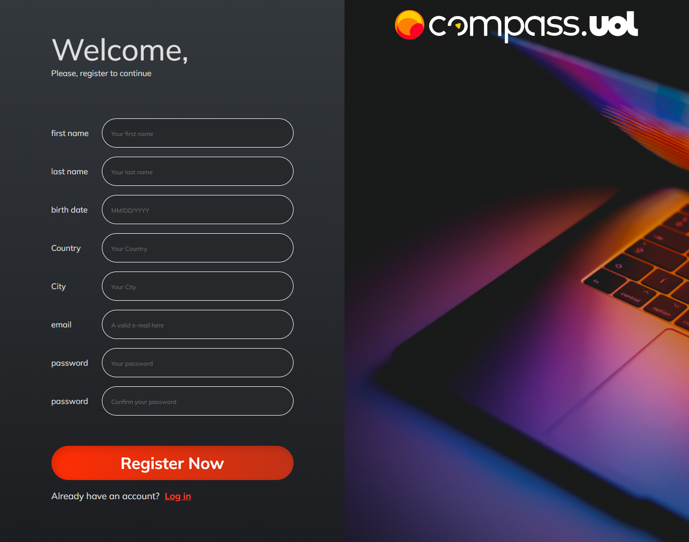
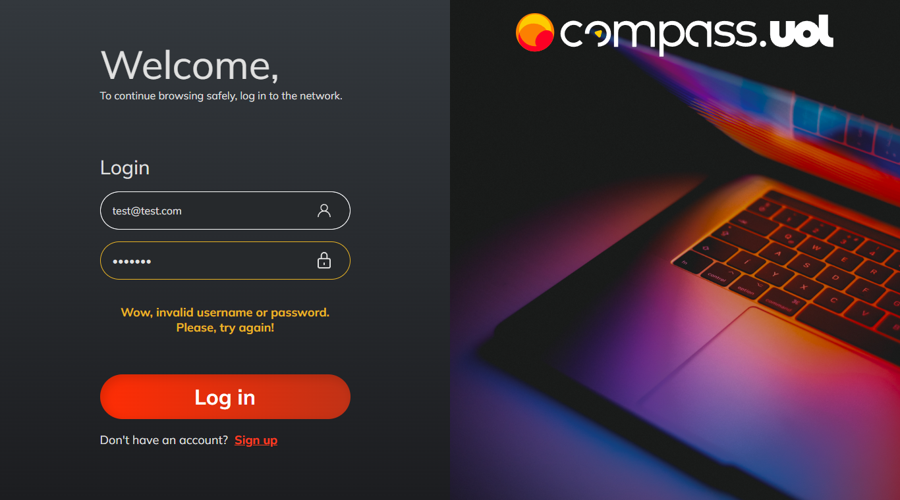
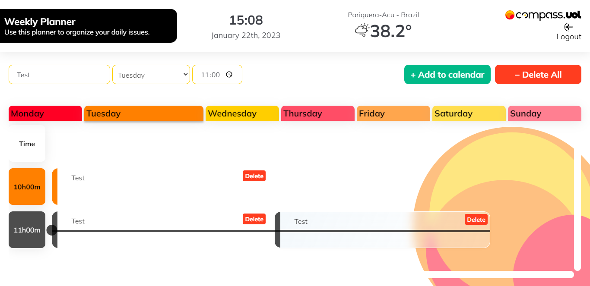
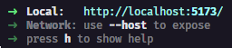

# 3º CHALLENGE PB AWS REACT - Weekly Planner

> A planner to organize your daily problems.

## Specifications

---

### Technologies

- HTML
- CSS
- JavaScript
- TypeScript
- React.js
  - React Icons
  - React Router
  - React Toastify
  - Styled Components

### Functionalities

- Simple authentication
- Protected routes
- Save token in _localStorage_ to persist login
- Validation of fields in the register and login forms
- Time and date in real time
- Climate according to the registered city
- Events sorted by time
- Visual feedback for conflicting events
- Use of REST API for event handling
- Visual error alerts, warnings and success messages
- Confirmation modal for deleting events
- Loading effect on REST requests

## Demonstration

---





## Development Setup

---

Step 1
Clone repository:

```bash
git clone https://github.com/davitorress/weekly-planner.git
```

---

Step 2
Install dependencies:

```bash
npm install
```

---

Step 3
Start application server:

```bash
npm run dev
```

---

Step 4
Opening application:

In the command terminal it will show the access links to the project, by default it is localhost on port 5173


