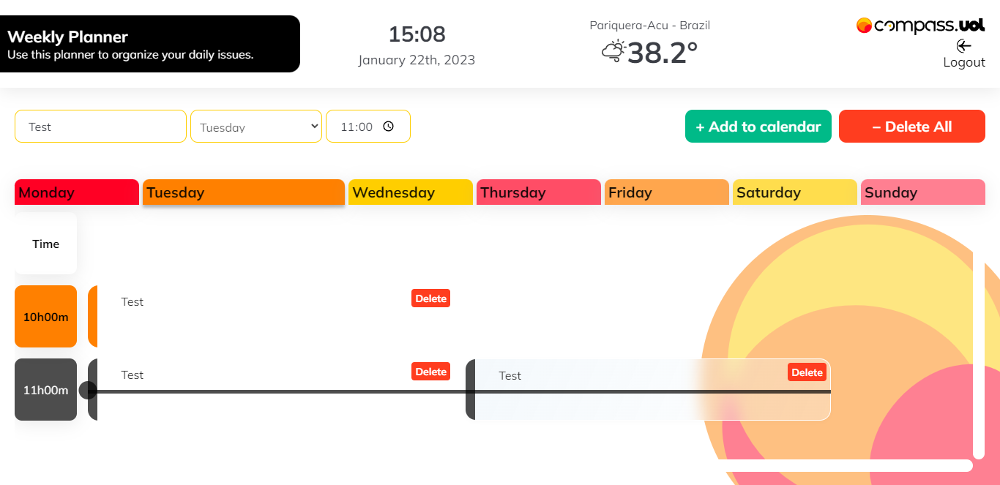
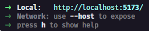

# 2º CHALLENGE PB AWS REACT - Weekly Planner

> A planner to organize your daily problems.

## Specifications

---

### Technologies

- HTML
- CSS
- JavaScript
- TypeScript
- React.js
  - React Router
  - Styled Components

### Functionalities

- Simple authentication
- Protected routes
- Save user in <i>localStorage</i>
- Validation of fields in the register and login forms
- Time and date in real time
- Climate according to the registered city
- Filter tasks by days of the week
- Tasks sorted by time
- Visual feedback for conflicting tasks

## Demonstration

---




## Development Setup

---

Step 1
Clone repository:

```bash
git clone https://github.com/davitorress/weekly-planner.git
```

---

Step 2
Install dependencies:

```bash
npm install
```

---

> **Note:**
> you will need an <i>API Key</i> from the <a href="https://www.weatherapi.com/" title="https://www.weatherapi.com/">Weather API</a> website and create a **.env** file in the root path with this content

```properties
VITE_APP_WEATHER_API_KEY = [YOUR API KEY]
```

---

Step 3
Start application server:

```bash
npm run dev
```

---

Step 4
Opening application:

In the command terminal it will show the access links to the project, by default it is localhost on port 5173


